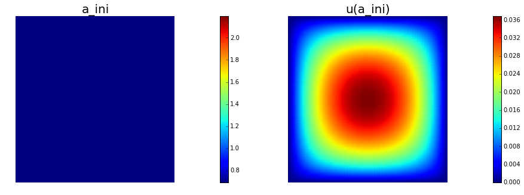

# Coefficient field inversion in an elliptic partial differential equation

We consider the estimation of a coefficient in an elliptic partial
differential equation as a model problem. Depending on the
interpretation of the unknowns and the type of measurements, this
model problem arises, for instance, in inversion for groundwater flow
or heat conductivity.  It can also be interpreted as finding a
membrane with a certain spatially varying stiffness. Let
$\Omega\subset\mathbb{R}^n$, $n\in\{1,2,3\}$ be an open, bounded
domain and consider the following problem:

$$
\min_{a} J(a):=\frac{1}{2}\int_\Omega (u-u_d)^2\, dx + \frac{\gamma}{2}\int_\Omega|\nabla a|^2\,dx,
$$

where $u$ is the solution of

$$
\begin{split}
\quad -\nabla\cdot(\exp(a)\nabla u) &= f \text{ in }\Omega,\\
u &= 0 \text{ on }\partial\Omega.
\end{split}
$$

Here $a\in U_{ad}:=\{a\in H^1(\Omega) \bigcap L^{\infty}(\Omega)\}$ the unknown coefficient field, $u_d$ denotes (possibly noisy) data, $f\in H^{-1}(\Omega)$ a given force, and $\gamma\ge 0$ the regularization parameter.

### The variational (or weak) form of the state equation:

Find $u\in H_0^1(\Omega)$ such that $(\exp(a)\nabla u,\nabla v) - (f,v) = 0, \text{ for all } v\in H_0^1(\Omega),$
where $H_0^1(\Omega)$ is the space of functions vanishing on $\partial\Omega$ with square integrable derivatives. Here, $(\cdot\,,\cdot)$ denotes the $L^2$-inner product, i.e, for scalar functions $u,v$ defined on $\Omega$ we denote $(u,v) := \int_\Omega u(x) v(x) \,dx$.

### Optimality System:

The Lagrangian functional $\mathscr{L}:H^1(\Omega)\times H_0^1(\Omega)\times H_0^1(\Omega)\rightarrow \mathbb{R}$, which we use as a tool to derive the optimality system, is given by

$$
\mathscr{L}(a,u,p):= \frac{1}{2}(u-u_d,u-u_d) +
\frac{\gamma}{2}(\nabla a, \nabla a) +  (\exp(a)\nabla u,\nabla p) - (f,p).
$$

The Lagrange multiplier theory shows that, at a solution all variations of the Lagrangian functional with respect to all variables must vanish. These variations of $\mathscr{L}$ with respect to $(p,u,a)$ in directions $(\tilde{u}, \tilde{p}, \tilde{a})$ are given by

$$
  \begin{alignat}{2}
    \mathscr{L}_p(a,u,p)(\tilde{p})  &= (\exp(a)\nabla u, \nabla \tilde{p}) -
    (f,\tilde{p}) &&= 0,\\
     \mathscr{L}_u(a,u,p)(\tilde{u}) &= (\exp(a)\nabla p, \nabla \tilde{u}) +
     (u-u_d,\tilde{u}) && = 0,\\
     \mathscr{L}_a(a,u,p)(\tilde{a})  &= \gamma(\nabla a, \nabla \tilde{a}) +
     (\tilde{a}\exp(a)\nabla u, \nabla p) &&= 0,
  \end{alignat}
$$

where the variations $(\tilde{u}, \tilde{p}, \tilde{a})$ are taken from the same spaces as $(u,p,a)$. 

The gradient of the cost functional $\mathcal{J}(a)$ therefore is

$$
    \mathcal{G}(a)(\tilde a) = \gamma(\nabla a, \nabla \tilde{a}) +
     (\tilde{a}\exp(a)\nabla u, \nabla \tilde{p}).
$$

### Inexact Newton-CG:

Newton's method requires second-order variational derivatives of the Lagrangian . Written in abstract form, it computes an update direction $(\hat a_k, \hat u_k,\hat p_k)$ from the following Newton step for the Lagrangian functional:

$$
\mathscr{L}''(a_k, u_k, p_k)\left[(\tilde
  a, \tilde u, \tilde p),(\hat a_k, \hat u_k, \hat p_k)\right] =
-\mathscr{L}'(a_k,u_k,p_k)(\tilde a, \tilde u, \tilde p),
$$

for all variations $(\tilde a, \tilde u, \tilde p)$, where $\mathscr{L}'$ and $\mathscr{L}''$ denote the first and
second variations of the Lagrangian. For the elliptic parameter inversion problem, this Newton step (written in variatonal form) is as follows: Find $(\hat u_k, \hat a_k,\hat p_k)$ as the solution of the linear system

$$
  \begin{array}{llll}
    (\hat{u}_k, \tilde u) &+ (\hat{a}_k \exp(a_k)\nabla p_k, \nabla
    \tilde u) &+ (\exp(a_k) \nabla \tilde u,
    \nabla \hat p_k) &= (u_d - u_k, \tilde u)- (\exp(a_k) \nabla
    p_k, \nabla \tilde u)\\
    (\tilde a \exp(a_k) \nabla \hat u_k, \nabla p_k) &+ \gamma
    (\nabla \hat a_k, \nabla \tilde a) + (\tilde a \hat a_k \exp(a_k)\nabla u, \nabla p) &+ (\tilde a
     \exp(a_k) \nabla u_k, \nabla \hat p_k) &= - \gamma (\nabla a_k, \nabla\tilde a) - (\tilde
      a  \exp(a_k) \nabla u_k, \nabla p_k)\\
    (\exp(a_k) \nabla \hat u_k, \nabla \tilde p) &+ (\hat a_k \exp(a_k) \nabla u_k, \nabla
      \tilde p) & &= - (\exp(a_k) \nabla u_k,
    \nabla \tilde p) + (f, \tilde p),
  \end{array}
$$

for all $(\tilde u, \tilde a, \tilde p)$.

### Discrete Newton system:
$
\def\tu{\tilde u}
\def\btu{\bf \tilde u}
\def\ta{\tilde a}
\def\bta{\bf \tilde a}
\def\tp{\tilde p}
\def\btp{\bf \tilde p}
\def\hu{\hat u}
\def\bhu{\bf \hat u}
\def\ha{\hat a}
\def\bha{\bf \hat a}
\def\hp{\hat p}
\def\bhp{\bf \hat p}
$
The discretized Newton step: denote the vectors corresponding to the discretization of the functions $\ha_k,\hu_k, \hp_k$ by $\bf \bha_k, \bhu_k$ and $\bhp_k$. Then, the discretization of the above system is given by the following symmetric linear system:

$$
  \begin{bmatrix}
    \bf W_{\scriptsize\mbox{uu}} & \bf W_{\scriptsize\mbox{ua}} & \bf A^T \\
    \bf W_{\scriptsize\mbox{au}} & \bf R + \bf R_{\scriptsize\mbox{aa}}& \bf C^T \\
    \bf A & \bf C & 0
\end{bmatrix}
\left[
  \begin{array}{c}
    \bhu_k \\
    \bha_k \\
    \bhp_k
  \end{array} \right] =
-\left[
  \begin{array}{ccc}
    \bf{g}_u\\
    \bf{g}_a\\
    \bf{g}_p
\end{array}
  \right],
$$

where $\bf W_{\scriptsize \mbox{uu}}$, $\bf W_{\scriptsize\mbox{ua}}$, $\bf W_{\scriptsize\mbox{au}}$, and $\bf R$ are the components of the Hessian matrix of the Lagrangian, $\bf A$ and $\bf C$ are the Jacobian of the state equation with respect to the state and the control variables, respectively and $\bf g_u$, $\bf g_a$, and $\bf g_p$ are the discrete gradients of the Lagrangian with respect to $\bf u $, $\bf a$ and $\bf p$, respectively.

### Reduced Hessian apply:

To eliminate the incremental state and adjoint variables, $\bhu_k$ and $\bhp_k$, from the first and last equations we use

$$
\begin{align}
\bhu_k &= -\bf A^{-1} \bf C \, \bha_k,\\
\bhp_k &= -\bf A^{-T} (\bf W_{\scriptsize\mbox{uu}} \bhu_k +
\bf W_{\scriptsize\mbox{ua}}\,\bha_k).
\end{align}
$$

This results in the following reduced linear system for the Newton step

$$
  \bf H \, \bha_k = -\bf{g}_a,
$$

with the reduced Hessian $\bf H$ applied to a vector $\bha$ given by

$$
  \bf H \bha = \underbrace{(\bf R + \bf R_{\scriptsize\mbox{aa}})}_{\text{Hessian of the regularization}} \bha +
    \underbrace{(\bf C^{T}\bf A^{-T} (\bf W_{\scriptsize\mbox{uu}}
    \bf A^{-1} \bf C - \bf W_{\scriptsize\mbox{ua}}) -
    \bf W_{\scriptsize\mbox{au}} \bf A^{-1}
    \bf C)}_{\text{Hessian of the data misfit}}\;\bha.
$$

### Goals:

By the end of this notebook, you should be able to:

- solve the forward and adjoint Poisson equations
- understand the inverse method framework
- visualise and understand the results
- modify the problem and code

### Mathematical tools used:

- Finite element method
- Derivation of gradiant and Hessian via the adjoint method
- inexact Newton-CG
- Armijo line search

### List of software used:

- <a href="http://fenicsproject.org/">FEniCS</a>, a parallel finite element element library for the discretization of partial differential equations
- <a href="http://www.mcs.anl.gov/petsc/">PETSc</a>, for scalable and efficient linear algebra operations and solvers
- <a href="http://matplotlib.org/">Matplotlib</a>, a python package used for plotting the results
- <a href="http://www.numpy.org/">Numpy</a>, a python package for linear algebra

## Set up

### Import dependencies


```python
from dolfin import *

import sys
sys.path.append( "../" )
from hippylib import *

import numpy as np
import time
import logging

import matplotlib.pyplot as plt
%matplotlib inline
import nb

start = time.clock()

logging.getLogger('FFC').setLevel(logging.WARNING)
logging.getLogger('UFL').setLevel(logging.WARNING)
set_log_active(False)

np.random.seed(seed=1)
```

### Model set up:

As in the introduction, the first thing we need to do is set up the numerical model.  In this cell, we set the mesh, the finite element functions $u, p, g$ corresponding to state, adjoint and coefficient/gradient variables, and the corresponding test functions and the parameters for the optimization.


```python
# create mesh and define function spaces
nx = 64
ny = 64
mesh = UnitSquareMesh(nx, ny)
Va = FunctionSpace(mesh, 'Lagrange', 1)
Vu = FunctionSpace(mesh, 'Lagrange', 2)

# The true and inverted parameter
atrue = interpolate(Expression('log(2 + 7*(pow(pow(x[0] - 0.5,2) + pow(x[1] - 0.5,2),0.5) > 0.2))', degree=5),Va)
a = interpolate(Expression("log(2.0)", degree=1),Va)

# define function for state and adjoint
u = Function(Vu)
p = Function(Vu)

# define Trial and Test Functions
u_trial, p_trial, a_trial = TrialFunction(Vu), TrialFunction(Vu), TrialFunction(Va)
u_test, p_test, a_test = TestFunction(Vu), TestFunction(Vu), TestFunction(Va)

# initialize input functions
f = Constant("1.0")
u0 = Constant("0.0")

# plot
plt.figure(figsize=(15,5))
nb.plot(mesh,subplot_loc=121, mytitle="Mesh", show_axis='on')
nb.plot(atrue,subplot_loc=122, mytitle="True parameter field")
plt.show()
```


```python
# set up dirichlet boundary conditions
def boundary(x,on_boundary):
    return on_boundary

bc_state = DirichletBC(Vu, u0, boundary)
bc_adj = DirichletBC(Vu, Constant(0.), boundary)
```

### Set up synthetic observations:

- Propose a coefficient field $a_{\text true}$ shown above
- The weak form of the pde: 
    Find $u\in H_0^1(\Omega)$ such that $\underbrace{(\exp(a_{\text true})\nabla u,\nabla v)}_{\; := \; a_{pde}} - \underbrace{(f,v)}_{\; := \;L_{pde}} = 0, \text{ for all } v\in H_0^1(\Omega)$.

- Perturb the solution: $u = u + \eta$, where $\eta \sim \mathcal{N}(0, \sigma)$


```python
# noise level
noise_level = 0.05

# weak form for setting up the synthetic observations
a_goal = inner(exp(atrue) * nabla_grad(u_trial), nabla_grad(u_test)) * dx
L_goal = f * u_test * dx

# solve the forward/state problem to generate synthetic observations
goal_A, goal_b = assemble_system(a_goal, L_goal, bc_state)

utrue = Function(Vu)
solve(goal_A, utrue.vector(), goal_b)

ud = Function(Vu)
ud.assign(utrue)

# perturb state solution and create synthetic measurements ud
# ud = u + ||u||/SNR * random.normal
MAX = ud.vector().norm("linf")
noise = Vector()
goal_A.init_vector(noise,1)
noise.set_local( noise_level * MAX * np.random.normal(0, 1, len(ud.vector().array())) )
bc_adj.apply(noise)

ud.vector().axpy(1., noise)

# plot
nb.multi1_plot([utrue, ud], ["State solution with atrue", "Synthetic observations"])
plt.show()
```


### The cost function evaluation:

$$
J(a):=\underbrace{\frac{1}{2}\int_\Omega (u-u_d)^2\, dx}_{\text misfit} + \underbrace{\frac{\gamma}{2}\int_\Omega|\nabla a|^2\,dx}_{\text reg}
$$

In the code below, $W$ and $R$ are symmetric positive definite matrices that stem from finite element discretization of the misfit and regularization component of the cost functional, respectively.


```python
# regularization parameter
gamma = 1e-8

# weak for for setting up the misfit and regularization compoment of the cost
W_equ   = inner(u_trial, u_test) * dx
R_equ   = gamma * inner(nabla_grad(a_trial), nabla_grad(a_test)) * dx

W = assemble(W_equ)
R = assemble(R_equ)

# refine cost function
def cost(u, ud, a, W, R):
    diff = u.vector() - ud.vector()
    reg = 0.5 * a.vector().inner(R*a.vector() ) 
    misfit = 0.5 * diff.inner(W * diff)
    return [reg + misfit, misfit, reg]
```

### Setting up the state equations, right hand side for the adjoint and the necessary matrices:

$$
  \begin{array}{llll}
    (\hat{u}_k, \tilde u) &+ (\hat{a}_k \exp(a_k)\nabla p_k, \nabla
    \tilde u) &+ (\exp(a_k) \nabla \tilde u,
    \nabla \hat p_k) &= (u_d - u_k, \tilde u)- (\exp(a_k) \nabla
    p_k, \nabla \tilde u)\\
    (\tilde a \exp(a_k) \nabla \hat u_k, \nabla p_k) &+ \gamma
    (\nabla \hat a_k, \nabla \tilde a) + (\tilde a \hat a_k \exp(a_k)\nabla u, \nabla p) &+ (\tilde a
     \exp(a_k) \nabla u_k, \nabla \hat p_k) &= - \gamma (\nabla a_k, \nabla\tilde a) - (\tilde
      a  \exp(a_k) \nabla u_k, \nabla p_k)\\
    (\exp(a_k) \nabla \hat u_k, \nabla \tilde p) &+ (\hat a_k \exp(a_k) \nabla u_k, \nabla
      \tilde p) & &= - (\exp(a_k) \nabla u_k,
    \nabla \tilde p) + (f, \tilde p),
  \end{array}
$$


```python
# weak form for setting up the state equation
a_state = inner(exp(a) * nabla_grad(u_trial), nabla_grad(u_test)) * dx
L_state = f * u_test * dx

# weak form for setting up the adjoint equation
a_adj = inner(exp(a) * nabla_grad(p_trial), nabla_grad(p_test)) * dx
L_adj = -inner(u - ud, p_test) * dx

# weak form for setting up matrices
Wua_equ = inner(exp(a) * a_trial * nabla_grad(p_test), nabla_grad(p)) * dx
C_equ   = inner(exp(a) * a_trial * nabla_grad(u), nabla_grad(u_test)) * dx
Raa_equ = inner(exp(a) * a_trial * a_test *  nabla_grad(u),  nabla_grad(p)) * dx

M_equ   = inner(a_trial, a_test) * dx

# assemble matrix M
M = assemble(M_equ)
```

### Initial guess
We solve the state equation and compute the cost functional for the initial guess of the parameter ``a_ini``


```python
# solve state equation
state_A, state_b = assemble_system (a_state, L_state, bc_state)
solve (state_A, u.vector(), state_b)

# evaluate cost
[cost_old, misfit_old, reg_old] = cost(u, ud, a, W, R)

# plot
plt.figure(figsize=(15,5))
nb.plot(a,subplot_loc=121, mytitle="a_ini", vmin=atrue.vector().min(), vmax=atrue.vector().max())
nb.plot(u,subplot_loc=122, mytitle="u(a_ini)")
plt.show()
```





### The reduced Hessian apply to a vector v:

Here we describe how to apply the reduced Hessian operator to a vector v. For an opportune choice of the regularization, the reduced Hessian operator evaluated in a neighborhood of the solution is positive define, whereas far from the solution the reduced Hessian may be indefinite. On the constrary, the Gauss-Newton approximation of the Hessian is always positive defined.

For this reason, it is beneficial to perform a few initial Gauss-Newton steps (5 in this particular example) to accelerate the convergence of the inexact Newton-CG algorithm.

The Hessian apply reads:
$$
\begin{align}
\bhu &= -\bf A^{-1} \bf C \bf v\, & \text{linearized forward}\\
\bhp &= -\bf A^{-T} (\bf W_{\scriptsize\mbox{uu}} \bhu +
\bf W_{\scriptsize\mbox{ua}}\,\bha) & \text{adjoint}\\
\bf H \bf v &= (\bf R + \bf R_{\scriptsize\mbox{aa}})\bf v + \bf C^T \bhp + \bf W_{\scriptsize\mbox{au}} \bhu.
\end{align}
$$

The Gauss-Newton Hessian apply is obtained by dropping the second derivatives operators $\bf W_{\scriptsize\mbox{ua}}\,\bha$, $\bf R_{\scriptsize\mbox{aa}}\bf v$, and $\bf W_{\scriptsize\mbox{au}} \bhu$:
$$
\begin{align}
\bhu &= -\bf A^{-1} \bf C \bf v\, & \text{linearized forward}\\
\bhp &= -\bf A^{-T} \bf W_{\scriptsize\mbox{uu}} \bhu & \text{adjoint}\\
\bf H_{\rm GN} \bf v &= \bf R \bf v + \bf C^T \bhp.
\end{align}
$$


```python
# Class HessianOperator to perform Hessian apply to a vector
class HessianOperator():
    cgiter = 0
    def __init__(self, R, Raa, C, A, adj_A, W, Wua, use_gaussnewton=False):
        self.R = R
        self.Raa = Raa
        self.C = C
        self.A = A
        self.adj_A = adj_A
        self.W = W
        self.Wua = Wua
        self.use_gaussnewton = use_gaussnewton
        
        # incremental state
        self.du = Vector()
        self.A.init_vector(self.du,0)
        
        #incremental adjoint
        self.dp = Vector()
        self.adj_A.init_vector(self.dp,0)
        
        # auxiliary vectors
        self.CT_dp = Vector()
        self.C.init_vector(self.CT_dp, 1)
        self.Wua_du = Vector()
        self.Wua.init_vector(self.Wua_du, 1)
        
    def init_vector(self, v, dim):
        self.R.init_vector(v,dim)

    # Hessian performed on x, output as generic vector y
    def mult(self, v, y):
        self.cgiter += 1
        y.zero()
        if self.use_gaussnewton:
            self.mult_GaussNewton(v,y)
        else:
            self.mult_Newton(v,y)
            
    # define (Gauss-Newton) Hessian apply H * v
    def mult_GaussNewton(self, v, y):
        
        #incremental forward
        rhs = -(self.C * v)
        bc_adj.apply(rhs)
        solve (self.A, self.du, rhs)
        
        #incremental adjoint
        rhs = - (self.W * self.du)
        bc_adj.apply(rhs)
        solve (self.adj_A, self.dp, rhs)
        
        # Reg/Prior term
        self.R.mult(v,y)
        
        # Misfit term
        self.C.transpmult(self.dp, self.CT_dp)
        y.axpy(1, self.CT_dp)
        
    # define (Newton) Hessian apply H * v
    def mult_Newton(self, v, y):
        
        #incremental forward
        rhs = -(self.C * v)
        bc_adj.apply(rhs)
        solve (self.A, self.du, rhs)
        
        #incremental adjoint
        rhs = -(self.W * self.du) -  self.Wua * v
        bc_adj.apply(rhs)
        solve (self.adj_A, self.dp, rhs)
        
        #Reg/Prior term
        self.R.mult(v,y)
        y.axpy(1., Raa*v)
        
        #Misfit term
        self.C.transpmult(self.dp, self.CT_dp)
        y.axpy(1., self.CT_dp)
        self.Wua.transpmult(self.du, self.Wua_du)
        y.axpy(1., self.Wua_du)
```

## The inexact Newton-CG optimization with Armijo line search:

We solve the constrained optimization problem using the inexact Newton-CG method with Armijo line search.

The stopping criterion is based on a relative reduction of the norm of the gradient (i.e. $\frac{\|g_{n}\|}{\|g_{0}\|} \leq \tau$).

First, we compute the gradient by solving the state and adjoint equation for the current parameter $a$, and then substituing the current state $u$, parameter $a$ and adjoint $p$ variables in the weak form expression of the gradient:
$$ (g, \tilde{a}) = \gamma(\nabla a, \nabla \tilde{a}) +(\tilde{a}\nabla u, \nabla p).$$

Then, we compute the Newton direction $\delta a$ by iteratively solving ${\bf H} {\delta a} = - {\bf g}$.
The Newton system is solved inexactly by early termination of conjugate gradient iterations via Eisenstat–Walker (to prevent oversolving) and Steihaug  (to avoid negative curvature) criteria.

Finally, the Armijo line search uses backtracking to find $\alpha$ such that a sufficient reduction in the cost functional is achieved.
More specifically, we use backtracking to find $\alpha$ such that:
$$J( a + \alpha \delta a ) \leq J(a) + \alpha c_{\rm armijo} (\delta a,g). $$


```python
# define parameters for the optimization
tol = 1e-8
c = 1e-4
maxiter = 12
plot_on = False

# initialize iter counters
iter = 1
total_cg_iter = 0
converged = False

# initializations
g, a_delta = Vector(), Vector()
R.init_vector(a_delta,0)
R.init_vector(g,0)

a_prev = Function(Va)

print "Nit   CGit   cost          misfit        reg           sqrt(-G*D)    ||grad||       alpha  tolcg"

while iter <  maxiter and not converged:

    # assemble matrix C
    C =  assemble(C_equ)

    # solve the adoint problem
    adjoint_A, adjoint_RHS = assemble_system(a_adj, L_adj, bc_adj)
    solve(adjoint_A, p.vector(), adjoint_RHS)

    # assemble W_ua and R
    Wua = assemble (Wua_equ)
    Raa = assemble (Raa_equ)

    # evaluate the  gradient
    CT_p = Vector()
    C.init_vector(CT_p,1)
    C.transpmult(p.vector(), CT_p)
    MG = CT_p + R * a.vector()
    solve(M, g, MG)

    # calculate the norm of the gradient
    grad2 = g.inner(MG)
    gradnorm = sqrt(grad2)

    # set the CG tolerance (use Eisenstat–Walker termination criterion)
    if iter == 1:
        gradnorm_ini = gradnorm
    tolcg = min(0.5, sqrt(gradnorm/gradnorm_ini))

    # define the Hessian apply operator (with preconditioner)
    Hess_Apply = HessianOperator(R, Raa, C, state_A, adjoint_A, W, Wua, use_gaussnewton=(iter<6) )
    P = R + gamma * M
    Psolver = PETScKrylovSolver("cg", amg_method())
    Psolver.set_operator(P)
    
    solver = CGSolverSteihaug()
    solver.set_operator(Hess_Apply)
    solver.set_preconditioner(Psolver)
    solver.parameters["rel_tolerance"] = tolcg
    solver.parameters["zero_initial_guess"] = True
    solver.parameters["print_level"] = -1

    # solve the Newton system H a_delta = - MG
    solver.solve(a_delta, -MG)
    total_cg_iter += Hess_Apply.cgiter
    
    # linesearch
    alpha = 1
    descent = 0
    no_backtrack = 0
    a_prev.assign(a)
    while descent == 0 and no_backtrack < 10:
        a.vector().axpy(alpha, a_delta )

        # solve the state/forward problem
        state_A, state_b = assemble_system(a_state, L_state, bc_state)
        solve(state_A, u.vector(), state_b)

        # evaluate cost
        [cost_new, misfit_new, reg_new] = cost(u, ud, a, W, R)

        # check if Armijo conditions are satisfied
        if cost_new < cost_old + alpha * c * MG.inner(a_delta):
            cost_old = cost_new
            descent = 1
        else:
            no_backtrack += 1
            alpha *= 0.5
            a.assign(a_prev)  # reset a

    # calculate sqrt(-G * D)
    graddir = sqrt(- MG.inner(a_delta) )

    sp = ""
    print "%2d %2s %2d %3s %8.5e %1s %8.5e %1s %8.5e %1s %8.5e %1s %8.5e %1s %5.2f %1s %5.3e" % \
        (iter, sp, Hess_Apply.cgiter, sp, cost_new, sp, misfit_new, sp, reg_new, sp, \
         graddir, sp, gradnorm, sp, alpha, sp, tolcg)

    if plot_on:
        nb.multi1_plot([a,u,p], ["a","u","p"], same_colorbar=False)
        plt.show()
    
    # check for convergence
    if gradnorm < tol and iter > 1:
        converged = True
        print "Newton's method converged in ",iter,"  iterations"
        print "Total number of CG iterations: ", total_cg_iter
        
    iter += 1
    
if not converged:
    print "Newton's method did not converge in ", maxiter, " iterations"

print "Time elapsed: ", time.clock()-start
```

    Nit   CGit   cost          misfit        reg           sqrt(-G*D)    ||grad||       alpha  tolcg
     1     1     1.12708e-05   1.12708e-05   1.33979e-11   1.56540e-02   3.79427e-04    1.00   5.000e-01
     2     1     7.79732e-07   7.79695e-07   3.67737e-11   4.68278e-03   5.35002e-05    1.00   3.755e-01
     3     1     3.10620e-07   3.10571e-07   4.91259e-11   9.71633e-04   7.13895e-06    1.00   1.372e-01
     4     5     1.92183e-07   1.62405e-07   2.97780e-08   4.51694e-04   1.00276e-06    1.00   5.141e-02
     5     1     1.86913e-07   1.57119e-07   2.97941e-08   1.02668e-04   6.12750e-07    1.00   4.019e-02
     6    12     1.80408e-07   1.37719e-07   4.26890e-08   1.15975e-04   2.24111e-07    1.00   2.430e-02
     7     5     1.80331e-07   1.38935e-07   4.13963e-08   1.23223e-05   4.17399e-08    1.00   1.049e-02
     8    15     1.80330e-07   1.39056e-07   4.12734e-08   1.74451e-06   3.43216e-09    1.00   3.008e-03
    Newton's method converged in  8   iterations
    Total number of CG iterations:  41
    Time elapsed:  9.28313


```python
nb.multi1_plot([atrue, a], ["atrue", "a"])
nb.multi1_plot([u,p], ["u","p"], same_colorbar=False)
plt.show()
```


