# Spectrum of the preconditioned Hessian misfit operator
## The linear source inversion problem

We consider the following linear source inversion problem.
Find the state $u \in H^1_{\Gamma_D}(\Omega)$ and the source (*parameter*) $m \in H^1(\Omega)$ that solves

$$
\begin{aligned}
{} & \min_m \frac{1}{2\sigma^2} \| Bu - u_d \|^2 + \frac{1}{2} \int_\Omega \left[ \delta|m-m_0|^2 + \gamma|\nabla (m - m_0)|^2 \right] dx & {}\\
{\rm s.t.} & {} &{} \\
{} & -{\rm div}(k \nabla u) + {\bf v}\cdot \nabla u + cu = m & {\rm in} \; \Omega\\
{} & u = 0 & {\rm on } \; \Gamma_D\\
{} & k \frac{\partial u}{\partial n} = 0 & {\rm on } \; \Gamma_N\\
\end{aligned}
$$

Here:

- $u_d$ is a $n_{\rm obs}$ finite dimensional vector that denotes noisy observations of the state $u$ in $n_{\rm obs}$ locations $\{ {\bf x}_i\}_{i=1}^{n_{\rm obs}}$. Specifically, $u_d(i) = u_{\rm true}( {\bf x}_i ) + \eta_i$, where $\eta_i$ are i.i.d. $\mathcal{N}(0, \sigma^2)$.

- $B: H^1_0(\Omega) \rightarrow \mathbb{R}^{n_{\rm obs}}$ is the linear operator that evaluates the state $u$ at the observation locations $\{ {\bf x}_i\}_{i=1}^{n_{\rm obs}}$.

- $\delta$ and $\gamma$ are the parameters of the regularization penalizing the $L^2(\Omega)$ and $H^1(\Omega)$ norm of $m-m_0$, respectively.

- $k$, ${\bf v}$, $c$ are given coefficients representing the diffusivity coefficient, the advective velocity and the reaction term, respectively.

- $\Gamma_D \subset \partial \Omega$, $\Gamma_N \subset \partial \Omega$ represents the subdomain of $\partial\Omega$ where we impose Dirichlet or Neumann boundary conditions, respectively.


## 1. Load modules


```python
from __future__ import absolute_import, division, print_function

import dolfin as dl
import numpy as np
import matplotlib.pyplot as plt
%matplotlib inline

import sys
import os
sys.path.append( os.environ.get('HIPPYLIB_BASE_DIR', "../") )
from hippylib import *

import logging
logging.getLogger('FFC').setLevel(logging.WARNING)
logging.getLogger('UFL').setLevel(logging.WARNING)
dl.set_log_active(False)
```

## 2. The linear source inversion problem


```python
def pde_varf(u,m,p):
    return k*dl.inner(dl.nabla_grad(u), dl.nabla_grad(p))*dl.dx \
           + dl.inner(dl.nabla_grad(u), v*p)*dl.dx \
           + c*u*p*dl.dx \
           - m*p*dl.dx

def u_boundary(x, on_boundary):
    return on_boundary and x[1] < dl.DOLFIN_EPS

def solve(nx,ny, targets, rel_noise, gamma, delta, verbose=True):
    myRandom = Random()
    mesh = dl.UnitSquareMesh(nx, ny)
    Vh1 = dl.FunctionSpace(mesh, 'Lagrange', 1)
    
    Vh = [Vh1, Vh1, Vh1]
    if verbose:
        print( "Number of dofs: STATE={0}, PARAMETER={1}, ADJOINT={2}".format(Vh[STATE].dim(), Vh[PARAMETER].dim(), Vh[ADJOINT].dim()) )


    u_bdr = dl.Constant(0.0)
    u_bdr0 = dl.Constant(0.0)
    bc = dl.DirichletBC(Vh[STATE], u_bdr, u_boundary)
    bc0 = dl.DirichletBC(Vh[STATE], u_bdr0, u_boundary)

    mtrue = dl.interpolate( dl.Expression('min(0.5,exp(-100*(pow(x[0]-0.35,2) +  pow(x[1]-0.7,2))))',degree=5), Vh[PARAMETER]).vector()
    m0 = dl.interpolate(dl.Constant(0.0), Vh[PARAMETER]).vector()
    
    pde = PDEVariationalProblem(Vh, pde_varf, bc, bc0, is_fwd_linear=True)
 
    if verbose:
        print( "Number of observation points: {0}".format(targets.shape[0]) )
        
    misfit = PointwiseStateObservation(Vh[STATE], targets)
    
    reg = LaplacianPrior(Vh[PARAMETER], gamma, delta)
                    
    #Generate synthetic observations
    utrue = pde.generate_state()
    x = [utrue, mtrue, None]
    pde.solveFwd(x[STATE], x, 1e-9)
    misfit.B.mult(x[STATE], misfit.d)
    MAX = misfit.d.norm("linf")
    noise_std_dev = rel_noise * MAX
    myRandom.normal_perturb(noise_std_dev, misfit.d)
    misfit.noise_variance = noise_std_dev*noise_std_dev

    if verbose:
        plt.figure(figsize=(18,4))
        nb.plot(dl.Function(Vh[PARAMETER], mtrue), mytitle = "True source", subplot_loc=131)
        nb.plot(dl.Function(Vh[STATE], utrue), mytitle="True state", subplot_loc=132)
        nb.plot_pts(targets, misfit.d,mytitle="Observations", subplot_loc=133)
        plt.show()
    
    model = Model(pde, reg, misfit)
    u = model.generate_vector(STATE)
    m = m0.copy()
    p = model.generate_vector(ADJOINT)
    x = [u,m,p]
    mg = model.generate_vector(PARAMETER)
    model.solveFwd(u, x)
    model.solveAdj(p, x)
    model.evalGradientParameter(x, mg)
    model.setPointForHessianEvaluations(x, gauss_newton_approx=False)

    H = ReducedHessian(model, 1e-12)

    solver = CGSolverSteihaug()
    solver.set_operator(H)
    solver.set_preconditioner( reg.Rsolver )
    solver.parameters["print_level"] = -1
    solver.parameters["rel_tolerance"] = 1e-9
    solver.solve(m, -mg)

    if solver.converged:
        if verbose:
            print( "CG converged in ", solver.iter, " iterations." )
    else:
        print( "CG did not converged." )
        raise

    model.solveFwd(u, x, 1e-12)
 
    total_cost, reg_cost, misfit_cost = model.cost(x)

    if verbose:
        plt.figure(figsize=(18,4))
        nb.plot(dl.Function(Vh[PARAMETER], m), mytitle = "Reconstructed source", subplot_loc=131)
        nb.plot(dl.Function(Vh[STATE], u), mytitle="Reconstructed state", subplot_loc=132)
        nb.plot_pts(targets, misfit.B*u - misfit.d, mytitle="Misfit", subplot_loc=133)
        plt.show()

    H.misfit_only = True
    k_evec = 80
    p_evec = 5
    if verbose:
        print( "Double Pass Algorithm. Requested eigenvectors: {0}; Oversampling {1}.".format(k_evec,p_evec) )
    Omega = MultiVector(x[PARAMETER], k_evec+p_evec)
    myRandom.normal(1., Omega)
    lmbda, V = doublePassG(H, reg.R, reg.Rsolver, Omega, k_evec)

    if verbose:
        plt.figure()
        nb.plot_eigenvalues(lmbda, mytitle="Generalized Eigenvalues")
        nb.plot_eigenvectors(Vh[PARAMETER], V, mytitle="Eigenvectors", which=[0,1,2,5,10,15])
        plt.show()
        
    return lmbda, V, Vh[PARAMETER], solver.iter

```

## 3. Solution of the source inversion problem


```python
ndim = 2
nx = 32
ny = 32

ntargets = 300
np.random.seed(seed=1)
targets = np.random.uniform(0.1,0.9, [ntargets, ndim] )
rel_noise = 0.01

gamma = 70.
delta = 1e-1

k = dl.Constant(1.0)
v = dl.Constant((0.0, 0.0))
c = dl.Constant(0.)

lmbda, V, Vm, nit = solve(nx,ny, targets, rel_noise, gamma, delta)
```

    Number of dofs: STATE=1089, PARAMETER=1089, ADJOINT=1089
    Number of observation points: 300


    CG converged in  67  iterations.


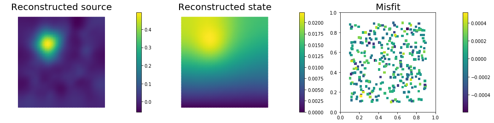


    Double Pass Algorithm. Requested eigenvectors: 80; Oversampling 5.


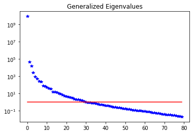


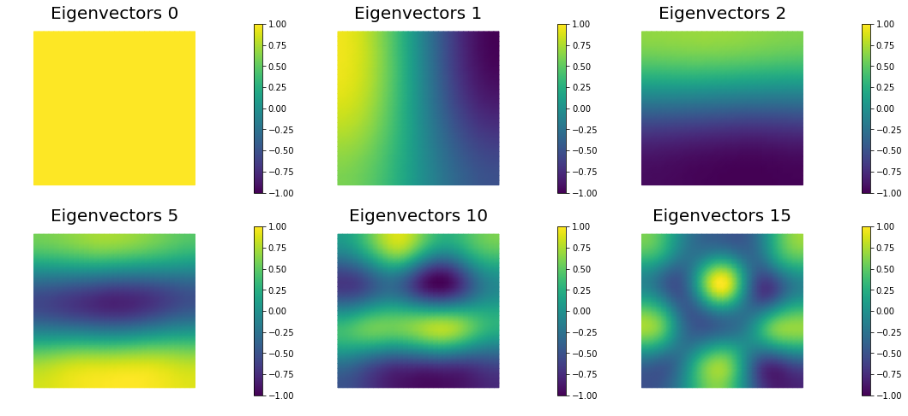


## 4. Mesh independence of the spectrum of the preconditioned Hessian misfit


```python
gamma = 70.
delta = 1e-1

k = dl.Constant(1.0)
v = dl.Constant((0.0, 0.0))
c = dl.Constant(0.)

n = [16,32,64]
lmbda1, V1, Vm1, niter1 = solve(n[0],n[0], targets, rel_noise, gamma, delta,verbose=False)
lmbda2, V2, Vm2, niter2 = solve(n[1],n[1], targets, rel_noise, gamma, delta,verbose=False)
lmbda3, V3, Vm3, niter3 = solve(n[2],n[2], targets, rel_noise, gamma, delta,verbose=False)

print( "Number of Iterations: ", niter1, niter2, niter3 )
plt.figure(figsize=(18,4))
nb.plot_eigenvalues(lmbda1, mytitle="Eigenvalues Mesh {0} by {1}".format(n[0],n[0]), subplot_loc=131)
nb.plot_eigenvalues(lmbda2, mytitle="Eigenvalues Mesh {0} by {1}".format(n[1],n[1]), subplot_loc=132)
nb.plot_eigenvalues(lmbda3, mytitle="Eigenvalues Mesh {0} by {1}".format(n[2],n[2]), subplot_loc=133)

nb.plot_eigenvectors(Vm1, V1, mytitle="Mesh {0} by {1} Eigen".format(n[0],n[0]), which=[0,1,5])
nb.plot_eigenvectors(Vm2, V2, mytitle="Mesh {0} by {1} Eigen".format(n[1],n[1]), which=[0,1,5])
nb.plot_eigenvectors(Vm3, V3, mytitle="Mesh {0} by {1} Eigen".format(n[2],n[2]), which=[0,1,5])

plt.show()
```

    Number of Iterations:  61 67 72


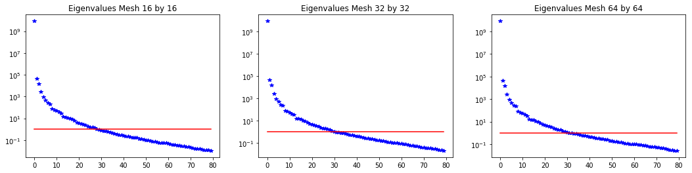


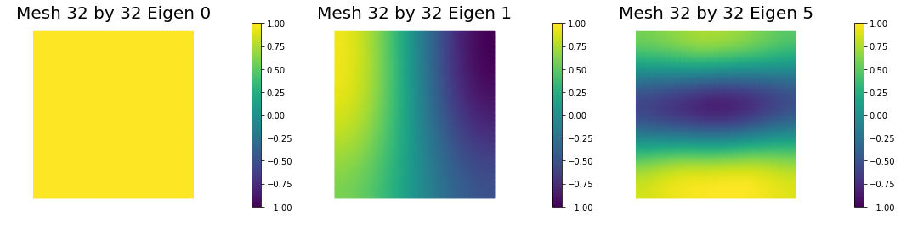


## 5. Dependence on the noise level

We solve the problem for different noise levels. The higher the noise level the more important becomes the effect of the regularization.


```python
gamma = 70.
delta = 1e-1

k = dl.Constant(1.0)
v = dl.Constant((0.0, 0.0))
c = dl.Constant(0.)

rel_noise = [1e-3,1e-2,1e-1]
lmbda1, V1, Vm1, niter1 = solve(nx,ny, targets, rel_noise[0], gamma, delta,verbose=False)
lmbda2, V2, Vm2, niter2 = solve(nx,ny, targets, rel_noise[1], gamma, delta,verbose=False)
lmbda3, V3, Vm3, niter3 = solve(nx,ny, targets, rel_noise[2], gamma, delta,verbose=False)

print( "Number of Iterations: ", niter1, niter2, niter3 )
plt.figure(figsize=(18,4))
nb.plot_eigenvalues(lmbda1, mytitle="Eigenvalues rel_noise {0:g}".format(rel_noise[0]), subplot_loc=131)
nb.plot_eigenvalues(lmbda2, mytitle="Eigenvalues rel_noise {0:g}".format(rel_noise[1]), subplot_loc=132)
nb.plot_eigenvalues(lmbda3, mytitle="Eigenvalues rel_noise {0:g}".format(rel_noise[2]), subplot_loc=133)

nb.plot_eigenvectors(Vm1, V1, mytitle="rel_noise {0:g} Eigen".format(rel_noise[0]), which=[0,1,5])
nb.plot_eigenvectors(Vm2, V2, mytitle="rel_noise {0:g} Eigen".format(rel_noise[1]), which=[0,1,5])
nb.plot_eigenvectors(Vm3, V3, mytitle="rel_noise {0:g} Eigen".format(rel_noise[2]), which=[0,1,5])

plt.show()
```

    Number of Iterations:  164 67 23


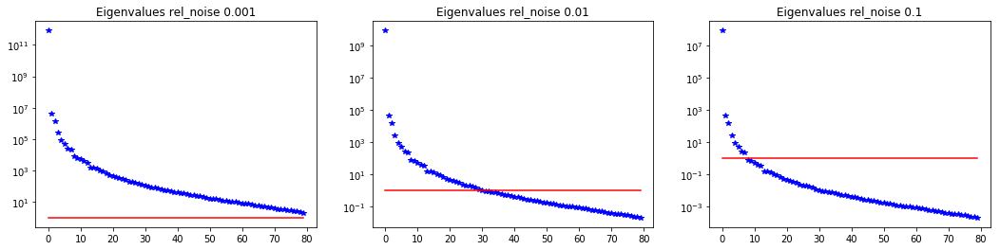


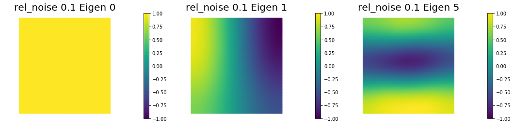


## 6. Dependence on the PDE coefficients

Assume a constant reaction term $c = 1$, and we consider different values for the diffusivity coefficient $k$.

The smaller the value of $k$ the slower the decay in the spectrum.


```python
rel_noise = 0.01

k = dl.Constant(1.0)
v = dl.Constant((0.0, 0.0))
c = dl.Constant(1.0)

lmbda1, V1, Vm1, niter1 = solve(nx,ny, targets, rel_noise, gamma, delta,verbose=False)
k = dl.Constant(0.1)
lmbda2, V2, Vm2, niter2 = solve(nx,ny, targets, rel_noise, gamma, delta,verbose=False)
k = dl.Constant(0.01)
lmbda3, V3, Vm3, niter3 = solve(nx,ny, targets, rel_noise, gamma, delta,verbose=False)

print( "Number of Iterations: ", niter1, niter2, niter3 )
plt.figure(figsize=(18,4))
nb.plot_eigenvalues(lmbda1, mytitle="Eigenvalues k=1.0", subplot_loc=131)
nb.plot_eigenvalues(lmbda2, mytitle="Eigenvalues k=0.1", subplot_loc=132)
nb.plot_eigenvalues(lmbda3, mytitle="Eigenvalues k=0.01", subplot_loc=133)

nb.plot_eigenvectors(Vm1, V1, mytitle="k=1. Eigen", which=[0,1,5])
nb.plot_eigenvectors(Vm2, V2, mytitle="k=0.1 Eigen", which=[0,1,5])
nb.plot_eigenvectors(Vm3, V3, mytitle="k=0.01 Eigen", which=[0,1,5])

plt.show()
```

    Number of Iterations:  79 143 244


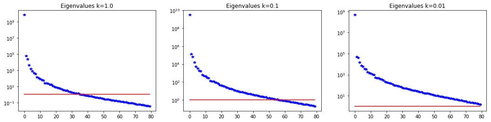


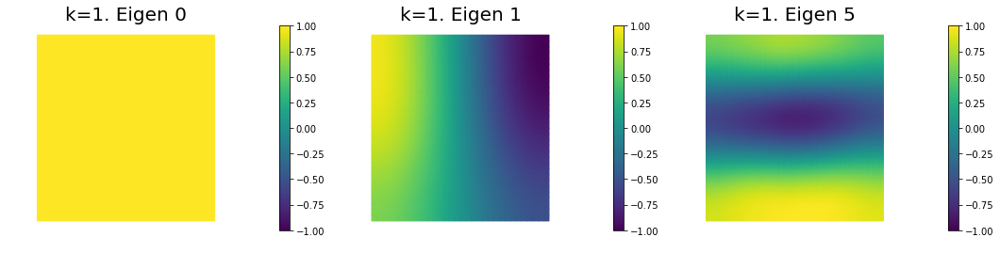


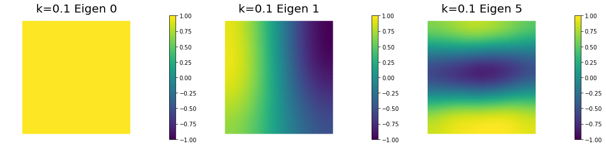


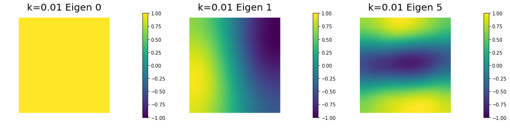


Copyright (c) 2016-2018, The University of Texas at Austin & University of California, Merced.<br>
All Rights reserved.<br>
See file COPYRIGHT for details.

This file is part of the hIPPYlib library. For more information and source code
availability see https://hippylib.github.io.

hIPPYlib is free software; you can redistribute it and/or modify it under the terms of the GNU General Public License (as published by the Free Software Foundation) version 2.0 dated June 1991.
